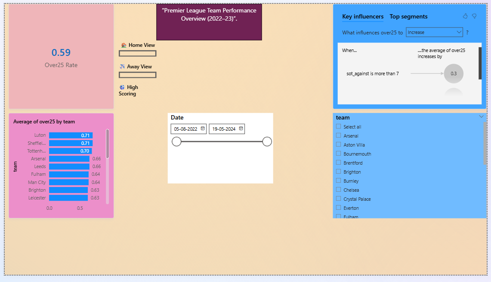

# Football Goals Prediction
This project is about predicting the number of goals in Premier League matches using historical match data and machine learning.
I worked with raw datasets, cleaned them, created useful features like team performance and match statistics, and then trained models to estimate expected goals for each match.
---
## Dashboard Preview

.
## Tools Used
- Python (Pandas, NumPy, Scikit-learn)
- Power BI
- Jupyter Notebook
---
## What I did
- Cleaned and prepared the dataset  
- Created match-level and team-level features  
- Trained machine learning models  
- Evaluated model performance  
- Built a Power BI dashboard to visualize results  
---
## Output
- Goal predictions for matches  
- Insights on team performance  
- Interactive dashboard showing trends  
---
## Files in this project
- data → datasets used  
- models → trained models  
- notebook → analysis and training  
- Prediction_DASHBOARD.pbix → Power BI dashboard  
---
## What I learned
- How to handle real-world messy data  
- Feature engineering for sports data  
- Basics of model evaluation  
- Presenting results using Power BI  
---
## Demo VIDEO LINK
https://drive.google.com/file/d/1qtP43zl-uJ0Gun_FYqILm7tkwrmbFTCH/view?usp=drive_link
